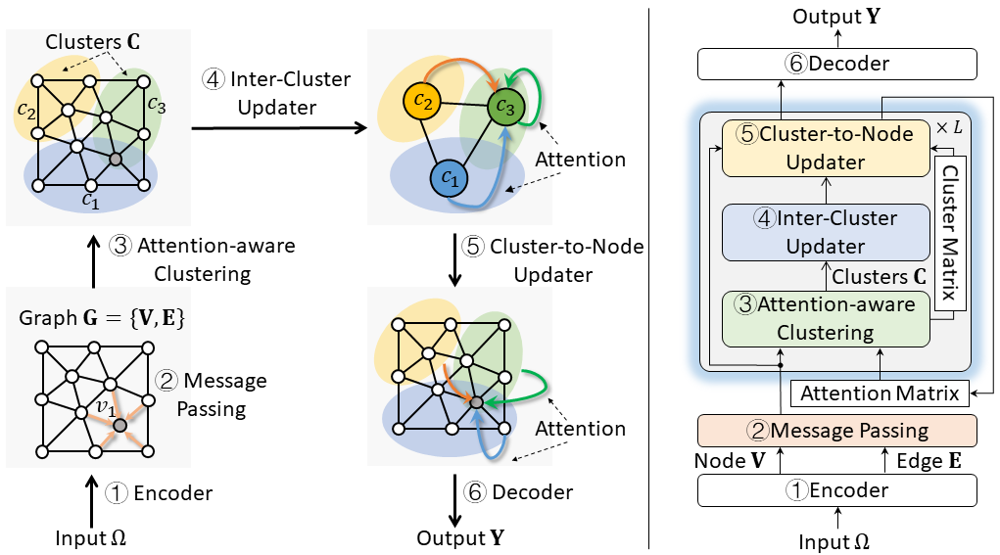
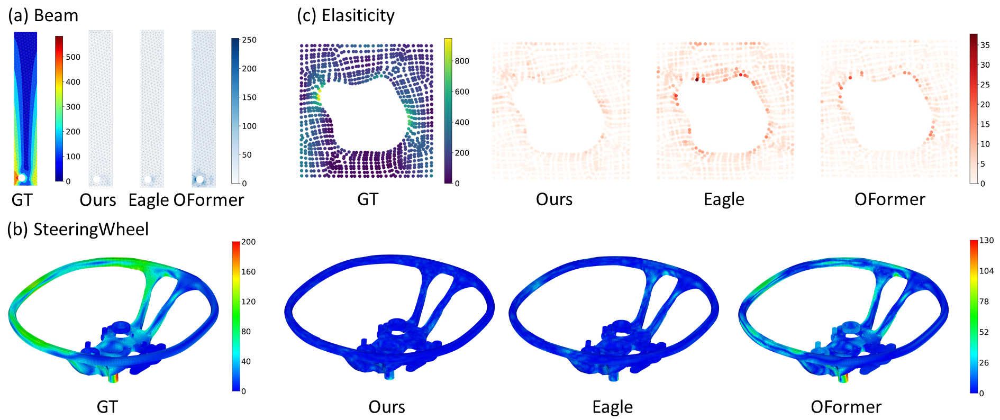

# SimFormer 
This repository contains the official PyTorch implementation of the paper:

> **SimFormer: A Multiscale Transformer Framework with Learnable Clustering for Mesh-based Simulation**
> *CIKM, 2025*
> 
---

## 🚀 Overview

Numerical simulation is important in real-world engineering systems, such as solid mechanics and aero-dynamics. Hierarchical GNNs can learn engineering simulation with low simulation time and acceptable accuracy, but fail to represent complex interactions in simulation systems. In this paper, we propose a novel multilevel Transformer on learnable clusters, namely SimFormer. The key novelty of SimFormer is to interweave the learning of a learnable soft-cluster assignment algorithm and the inter-cluster/cluster-node attention. In form of a closed-loop, SimFormer learns the soft cluster assignment possibility by the feedback signals provided by the attention, and the attention can leverage the learnable clusters to better represent long-range interactions. In this way, the learnable clusters can adaptively match actual simulation results, and the multilevel attention modules can also effectively represent node embeddings. Experiments on four datasets demonstrate the superiority of SimFormer over seven baseline approaches. For example, on the real dataset, ours outperforms the recent work Eagle by 17.36\% lower RMSE and 27.03\% smaller FLOPs.


---

## 📦 Installation

Requirements:
- Python 3.8.10
- PyTorch 1.11.0+cu113
- CUDA 11.3

```bash
conda create -n simformer python=3.8.10
conda activate simformer

pip install -r requirements.txt
```

## 📂 Datasets

We evaluate SimFormer on:

- Beam
- SteeringWheel
- [Elasticity](https://drive.google.com/drive/folders/1cznHmQO-hB_VlWOfh7IFpjsPVOYyghGJ)
- [DrivAerNet](https://github.com/Mohamedelrefaie/DrivAerNet)

## 🧪 Training & Evaluation

### Train and Evaluate on Beam dataset:

```bash
python Beam-main.py --num_epochs=1000
python Beam-main.py --num_epochs=0
```

## 🎨 Visualizations

